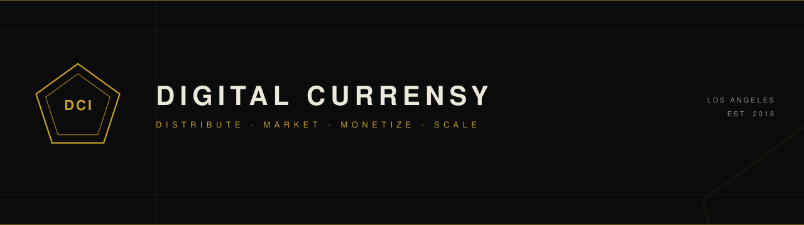
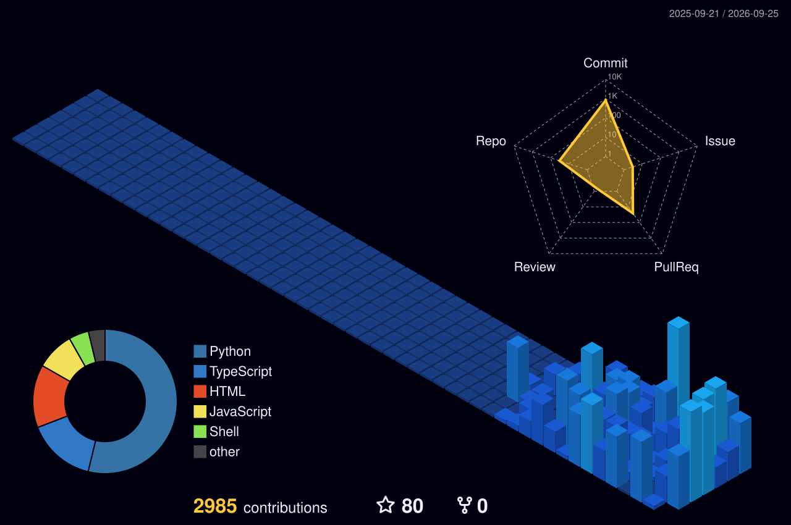

  

<h1 align="center">Digital Currensy Inc.</h1>

  <strong>Distribute&nbsp;&nbsp;·&nbsp;&nbsp;Market&nbsp;&nbsp;·&nbsp;&nbsp;Monetize&nbsp;&nbsp;·&nbsp;&nbsp;Scale</strong>

  Infrastructure for independent artists, labels, and managers. 
  Los Angeles · Est. 2018

  
  
  
  
  

---

**Digital Currensy Inc. (DCI)** is the platform independent music teams use to release globally — distribution, campaigns, royalties, playlists, sync prep, and AI tools.

No upfront fee. Artists keep **80%**. DCI keeps 20% to run the infrastructure.

Not a crypto exchange. Not a token sale. Not a record deal.

**Live** → [digitalcurrensy.com](https://www.digitalcurrensy.com) · **AI studio** → [app.labeliq.ai](https://app.labeliq.ai) · **Founder** → [adrianswish.xyz](https://adrianswish.xyz)

## Signal

| **100M+** | **800+** | **$600K+** | **15K+** |
|:---:|:---:|:---:|:---:|
| Streams | Artists | Revenue | Assets |

30+ in-house playlists · 20K+ artist opt-ins · Founded 2018 in Los Angeles.

## Platforms

| Surface | Role | URL |
| --- | --- | --- |
| **Digital Currensy** | Global distribution · 80/20 split · campaigns | [digitalcurrensy.com](https://www.digitalcurrensy.com) |
| **Label IQ AI** | AI songs, videos, assets, fan campaigns | [app.labeliq.ai](https://app.labeliq.ai) |
| **Adrian Swish** | Founder headquarters | [adrianswish.xyz](https://adrianswish.xyz) |
| **Rich Off Pints** | Icewear Vezzo / ROP 4 | [richoffpints.com](https://richoffpints.com) |
| **The U Prep** | Basketball academy · Glendale & Torrance | [theubasketballprepacademy.com](https://www.theubasketballprepacademy.com) |
| **Compton One** | Civic navigator · EN / ES / TL / ZH | [github.com/DigitalCurrensy/compton-one](https://github.com/DigitalCurrensy/compton-one) |

## Selected work

<table>
  <tr>
    <td width="50%">
      
    </td>
    <td width="50%">
      
    </td>
  </tr>
  <tr>
    <td>
      
    </td>
    <td>
      
    </td>
  </tr>
  <tr>
    <td>
      
    </td>
    <td>
      
    </td>
  </tr>
</table>

## Stack

  
  
  
  
  
  
  
  
  

## Activity

  
  

  

  

  

<!-- Snake animation: generated to the output branch by .github/workflows/snake.yml.
     After the first Actions run, replace this comment with the picture block below.

  <picture>
    <source media="(prefers-color-scheme: dark)" srcset="https://raw.githubusercontent.com/DigitalCurrensy/digitalcurrensy/output/github-contribution-grid-snake-dark.svg">
    
  </picture>

-->

## Papers

- [DCI Whitepaper (2025)](https://github.com/DigitalCurrensy/DCI-WHITEPAPER) — company thesis. Historical text. Not a live settlement rail.
- [Label IQ Whitepaper (2025)](https://github.com/DigitalCurrensy/LABEL-IQ-WHITEPAPER) — spec text. Not a live minting rail.

## Contact

| | |
| --- | --- |
| Company | [digitalcurrensy.com](https://www.digitalcurrensy.com) |
| Email | [info@digitalcurrensy.com](mailto:info@digitalcurrensy.com) |
| Founder | [adrianswish.xyz](https://adrianswish.xyz) · [swish@digitalcurrensy.com](mailto:swish@digitalcurrensy.com) |
| Booking | [adrianswish.book.kiwilaunch.com](https://adrianswish.book.kiwilaunch.com/) |
| X | [@digitalcurrensy](https://x.com/digitalcurrensy) |
| Instagram | [@digitalcurrensy](https://instagram.com/digitalcurrensy) |
| YouTube | [@DigitalCurrensy](https://www.youtube.com/@DigitalCurrensy) |

© 2026 Digital Currensy Inc. · Los Angeles
